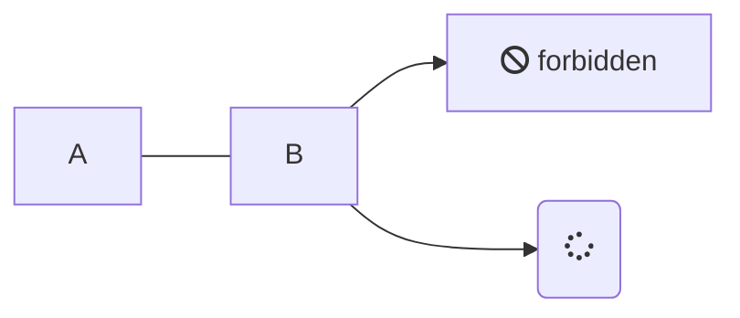
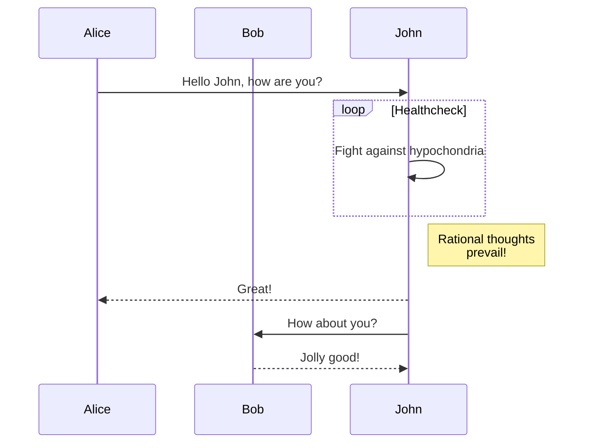

# National Geographic Information Standards Set 

OS National Geographic Information Standards Set as part of PSGA

"UK priorities: moving towards a ‘national geo standard set’ to support an SDI / IGIF"
Initial target date: Consensus on initial national standards set by Q3
GC requested change: add ", with a prioritised action plan" (not formally agreed)
 
Later GC conversation, towards PSGA Standards Plan 2021 forward centred around GC publishing the 2018 report lists and asking for comment, while OS focussed on defining "what good looks like" for the Standards Pillar in a UNGGIM IGIF style national Location Data Framework.

## Introduction

https://www.gov.uk/government/collections/open-standards-for-government-data-and-technology

https://www.gov.uk/service-manual/technology/working-with-open-standards

https://www.gov.uk/government/publications/open-standards-principles/open-standards-principles

"As recognised in the 2008 UK Location Strategy, the UK would benefit from a common set of technical standards for geographic data. This would enable a common infrastructure, resulting in easier access and interoperability of the data from different organisations, and to different data users. Such a set of standards is not static; after agreeing an initial set, it will be important to have in place well resourced governance to continue to ensure that the standards are kept in step with changing technology and requirements. 

Other countries are benefitting from such a managed set of standards, e.g. Netherlands, United States. 

As the National Mapping Authority, Ordnance Survey (OS) regularly provides leadership to the existing work on geographic information standards, at the British Standards Institution (Chair & Secretary of their technical committee on GI: IST/36), Open Geospatial Consortium (OGC; only UK strategic member), and Association for Geographic Information (AGI, Chair & Secretary of their standards committee). Through these, OS also regularly takes a lead in international geographic standardisation, at ISO TC211, and at OGC – alongside BGS, DSTL, and the Met Office. Similarly, as one of the technical delivery partners for the UK’s response to INSPIRE, OS works alongside Defra, the Government Digital Service, the Scottish Government, and BGS on the technical aspects of implementing the current Spatial Data Infrastructure (SD) in UK. More widely, OS already has functioning relationships with the National Infrastructure Commission / Centre for Digital Built Britain’s National Digital Twin Initiative, directly with major infrastructure developers, and with the Government Digital Service. 

All this places OS in a good position to take a lead on establishing the initial consensus and developing a mechanism to manage it. 

Leaving the European Union provides both opportunity and threat in this area: the opportunity to evolve our national SDI and standard set to priorities our own UK requirements; the threat that without the governance / oversight currently provided by the European Commission’s Joint Research Centre, our national implementation loses the coherence that it has achieved in the past ten years. 

This work has started informally, under the auspices of the AGI, with just a single workshop facilitated by OS, involving the Geo6 organisations, plus Defra, Met Office, Ministry of Defence, Office of National Statistics, and OGC. 

> Note: in this context at least, the definition of ‘standard’ includes the INSPIRE specifications and technical guidelines – which are maintained by consensus, and available free of charge to reuse. This technical work is independent of which UK body has the ‘policy lead’ for INSPIRE – this is currently Defra, supported by the devolved administrations, particularly the Scottish Government. 

Scope and approach 

Phase 1 – Consolidate an initial set of standards (6 months) 
- Agree priorities from the 10 standards & technical areas identified in the initial workshop, including: 
  - Which are stable 
  - Which need work, and where that work is best done 
- Check this with other data publishers, beyond the ten involved so far 
- Cross check this with data users, involving OGC and the Open Data Institute 
- Cross check with other national data infrastructure initiatives, including from the National Infrastructure Commission / Centre for Digital Built Britain, and the Government Digital Service 
- Agree what other areas would be essential or useful, for example common approaches to data quality – both improving quality and reporting it. 
- Determine which organisation in the UK, and overseas, is best placed to lead each work item 
- Forecast when it will be possible to have a mature enough initial set. Note: we may agree that what we have already is mature enough, even though some areas need work. "

----

Emerging consensus
A number of standards were mentioned by quite a few presenters, and therefore represent an existing consensus at
least in some areas. Most of these are standards encouraged by the European Commission’s INSPIRE initiative, for
metadata, map views, feature access, and feature data. The INSPIRE specifications for various themes were also
mentioned.
Data access standards
The consensus on the day was in the area of data access – perhaps reflecting that open standards are most apparent
at organisations’ external interfaces.
• OGC Web Map Service (WMS; ISO 19128; INSPIRE) – seven organisations
• OGC Web Feature Service (WFS; ISO 19142; INSPIRE) – five organisations
• GeoJSON / IETF RFC 7946 within its capabilities – five organisations
• OGC Geography Markup Language (GML; ISO 19136; INSPIRE) – four organisations
Emerging (three organisations each):
• working with REST architectural patterns.
• forms of JSON other than GeoJSON
• XML other than GML
• CSV, including ‘CSV for the web’
Metadata for discovery, evaluation, and use
Most organisations publish their metadata using ISO 19115 / 19119 / 19139, as advised by INSPIRE, and use the UK
GEMINI profile & guidance. This is the structure and format used by data.gov.uk, as well as by some off the shelf
solutions.
Gazetteers
The UK’s own standard, BS7666 Spatial datasets for geograp

### Conceptual/Schema Standards

### Syntax/Encoding Standards

### Interactive Web Services/API's Standards

## Geospatial Data

### Locations

UK gov has already agreeded two standards related to sharing location within gov and externally. 

#### Addresses

https://www.gov.uk/government/publications/open-standards-for-government/identifying-property-and-street-information 

### Vector Data

#### Conceptual/Schema Standards

Point data - https://www.gov.uk/government/publications/open-standards-for-government/exchange-of-location-point
 
#### Syntax/Encoding Standards

##### CSV

What is it for?
Publication of simple tabular data, including geographic coordinates (particularly when those are also simple e.g. points).
Current standard(s)
Widely seen as an informal convention, the IETF have actually documented it: RFC4180.
W3C have built on this, at https://www.w3.org/TR/2015/REC-tabular-data-model-20151217/ - generally known as “CSV for the web”.

##### JSON

What is it for?
Publishing (enabling access to) feature instances in a way that’s familiar to many software developers.
Current standard(s)
GeoJSON (IETF RFC 2946)
JSON and JSON-LD are not specifically ‘for geography’ but are often used.
Known issues
Since agreement / publication as a ‘full’ standard, GeoJSON has two major constraints:
In practice, all data has to be in WGS-84 (longitude, latitude, decimal degrees: urn:ogc:def:crs:OGC::CRS84 – which is like EPSG:4326, but with the coordinates reversed!)
It does not support anything in three dimensions, such as solid geometries
And some issues in common with JSON in general
No agreed way to state what version of JSON/GeoJSON a particular instance uses. This is particularly an issue with GeoJSON, as the ‘pre-standard’ 2008 version, which was/is widely used, does support other coordinate systems (for example)
This is part of the broader desire for JSON to be light weight and simple, and therefore not carry explicit semantics.

Perhaps because of these issues, data published in JSON generally needs a bespoke application to consume it. Generic JSON-reading into has to make a number of assumptions about the data.

Many organisations have their own workarounds, e.g. publishing JSON that looks like GeoJSON but just uses a different CRS. In fact, the GeoJSON spec notes that “where all    involved parties have a prior arrangement, alternative coordinate reference systems can be used without risk of data being misinterpreted.” So arguably, this is actually GeoJSON, but only privately useful!

Note: support for non WGS-84 data is not only a ‘legacy issue’; there are a number of use cases where other coordinate reference systems are required: 3D, engineering (where it helps to have right angles), long term persistence (CRS that cope with tectonic drift). See https://www.w3.org/TR/sdw-bp/#geometry-and-crs

Note: urn:ogc:def:crs:OGC::CRS84 / EPSG:4326 is an ‘undated’ reference to WGS84, so may mean any of the five revisions so far, or any future one. Without an associated date, this does not take account of changes in the earth’s surface.
External work / discussions in progress
GeoJSON is extensively discussed in the Spatial Data on the Web Best Practices
JSON Schema
JSON schema, to support validation of JSON documents, is a work in progress – but already in live use.
OGC
In September 2017, OGC published a JSON encoding best practice for Sensor Web Enablement (17-011). Various groups within OGC are working on JSON encodings for particular domains, e.g. CityJSON, JSON extension for moving features, Coverage JSON, WFS3.0.
There has been some discussion of a common OGC approach to JSON.
INSPIRE
INSPIRE has an active task looking at JSON encoding for INSPIRE. 

##### OGC GeoPackage

##### XML

What is it for?
Publishing (enabling access to) feature instances in a way that’s familiar to many software developers – although less ‘in vogue’ in the past few years.
Current standard(s)
OGC Geography Markup Language: GML 3.2 / 3.3
Equivalent to ISO 19136-1:2008 / ISO 19136-2:2015
Note: GML 3.3 / ISO 19136-2 contains some optional extensions which can be used alongside GML 3.2 / 19136-1.
OGC GML Simple Feature profile
Many specific GML schemas, from INSPIRE and domain communities (Geo-science, hydrography)

Other specific XML encodings:
GPX, for transfer of waypoints, tracks, and routes. Commonly used to/from GPS devices
OGC KML, concentrating on the graphical representation of (2D) geometry.
Known issues
Complexity
GML is a large & complex standard; there are probably no implementations which make use of it all – or need to. This means there are a range of domain specific subsets, which may make different implementation choices, and therefore involve data which may not be easily used outside that domain.
For example, underground geology is naturally three dimensional; the geology community has software which can cope with their three-dimensional objects. But may not cope with those shared within the meteorology community.
The OGC simple features profile was developed to address this issue and works well where appropriate – but not all features are ‘simple’.
Web-like approaches
GML 3.3 encourages data instances to refer out to other relevant objects, such as related feature instances, or controlled vocabulary entries. It uses ‘web standard’ mechanism for this (W3C xlink).
But many aspects of XLink are not widely supported in the current software, and almost no software validates the target of the link.
For example, a number of INSPIRE specifications encourage the use of xlink:title, but very little software either populates or displays this.
Dislike by developers
Perhaps because many XML (GML) parsers insist on loading the whole data into memory before processing, a lot of software developers have gone off XML!
Dislike among users
Perhaps because of these issues – and the resulting difficulty finding software to read specific GML, and perhaps because older GML products (such as OS MasterMap Topography Layer) were designed before any GML best practices existed, many users have come to view GML as hard to use.
External work / discussions in progress
TC211 catch up
OGC has GML 3.2.1, which is a corrigendum allowing gml:id on LinearRing. This is ISO/DIS 19136-1, expected to be published in early 2019.

#### Interactive Web Services/API's Standards

##### OGC WFS 2.0.2, with OGC Filter Encoding 2.0.2

Enabling access to feature instances (‘real world object’ representations) via the web, either individually or as collections.

This is the INSPIRE Download Service ‘direct access’ option

Note: the “parallel” ISO 19142 and 19143 are “stuck” at the OGC 2.0 release. TC211 has decided not to update them, preferring to concentrate on the new WFS 3.0 (even though it will be some years before that is mature) - resource constraints.

Known issues
Allowing ‘unconstrained’ access to a WFS can place a high demand on the server, because it can support any query making it almost impossible to cache results - every web query must be processed against the data
The web interface follows an old web design pattern (“not webby enough1”)
OGC web services have no standardised way of managing security (authentication, access control)
Being a complex pair of standards, very few implementations actually implement all of it, so it’s difficult to identify just what a ‘compliant’ implementation actually does implement.
The only standardised way to return data is in XML/GML, although most implementations also offer (non standardised) JSON.
For some, the ISO standards remaining at 2.0 could be a problem

##### OGCAPI-Features

Adopt a modern web architecture, in line with the W3C/OGC SDW Best Practices
Make the standard modular, so it is clearer which functions are implemented by specific software and running servers

##### Other

“Roll your own” APIs returning JSON
“Linked data”: returning feature instances as RDF (XML or JSON) & HTML
Exposing the feature instances as HTML (See SDWBP), preferably with embedded micro-date (metadata, XML or JSON representations)
Making datasets directly web accessible (INSPIRE Download Service ‘pre-defined dataset’ - requires supporting this with an Atom feed)
ESRI have implemented a ‘version’ of Vector Tiles which allows other CRSs, but this it not widely supported.

### Raster Data

May be raster data such as saterllite imagery but may be a map made of vector data.     

#### Conceptual/Schema Standards

#### Syntax/Encoding Standards

OGC SLD - Styling

#### Interactive Web Services/API's Standards

##### OGC WMS / ISO 19128
##### WMTS

OGC WMS:
The web interface follows an old web design pattern (“not webby enough”)
OGC web services have no standardised way of managing security (authentication, access control)
Being a complex pair of standards, very few implementations actually implement all of it, so it’s difficult to identify just what a ‘compliant’ implementation actually does implement.
By allowing users to request any geographic area, WMS can be hard to cache. WMTS was developed to work around this, by predefining the areas that can be requested.

##### MapboxTiles

##### OGCAPI-Styles

### Gazeteer/Addressing

#### Syntax/Encoding Standards

What is it for?
BS7666 is the basis of the GeoPlace specification for transferring local address & street gazetteer information from local authorities to GeoPlace, who consolidate it into the National Address Gazetteer.

This is one of the most commonly used national reference datasets (often as OS AddressBase), and contributes the National Street Gazetteer into OS Highways & OS Open Roads, which are also becoming widely used reference data sets.
Current standard(s)
BS7666
The INSPIRE Address Specification
Note: not in use in UK?
ISO 19160 (various parts)
GeoPlace have published how BS7666 relates to ISO 19160-1.

There are other standard which are suitable for specific addressing use cases. For example, UK Cabinet Office recommends vCard (IETF RFC6350) for the publishing contact information (e.g. addresses for meetings/appointments).
Known issues
External work / discussions in progress
BSI/AGI are preparing a revised version of BS7666, which should enter public review towards the end of 2018. This is based on a wide public consultation that took place in 2016/2017.

#### Interactive Web Services/API's Standards

## Time-Series Data

### Conceptual/Schema Standards

### Syntax/Encoding Standards

### Interactive Web Services/API's Standards

## Environmental Data

### Conceptual/Schema Standards

### Syntax/Encoding Standards

### Interactive Web Services/API's Standards

## Metadata

### Conceptual/Schema Standards

GEMINI 2.2 (& 2.3), based on ISO 19115:2003, 19119, and 19139:2006
OpenSearch

Known issues
GEMINI 2.2 doesn’t include everything that’s in the current INSPIRE TG - in particular, not many metadata elements to describe data quality.
Most metadata records are poorly maintained.
Most metadata records are not detailed enough to support common ‘discoverability’ use cases, such as searching for ‘real world terms’
Although OpenSearch is described in the INSPIRE Metadata TG, it isn’t widely understood (or used?) - at least in the UK geo community.
External work / discussion in progress
GEMINI 2.3
AGI have published GEMINI 2.3, which catches up with INSPIRE. INSPIRE (European & UK) expects publishers to migrate to this by December 2019.
UK lead: Peter Parslow
Web friendly metadata
W3C, OGC, and INSPIRE are all discussing how to make geo metadata more ‘web friendly’, that is how to publish the metadata in ways that make it more directly discoverable by web search engines (Google, Bing,...), rather than only in portals.
Mainly, this involves looking to publish the metadata (also) in GeoDCAT and / or Schema.org.
International lead: Simon Cox, Australia?
UK lead: ? (it has some overlap with W3C SDWIG - in which Michael Gordon & …. Met Office are active)
W3C DCAT updates
W3C are changing DCAT. The OGC/W3C SDWIG is involved in this.
Modernising ISO 19115
ISO TC211 have updated ISO 19115 to incorporate the metadata parts of ISO 19119, and further enrich the description of data quality. 19115-1 is the updated logical model; 19115-3 is the updated XML implementation (replacing that aspect of ISO 19139). TC211 have published XML transforms that can assist migration.
INSPIRE has no current plan to migrate to this. They would appreciate someone documenting the impact it would have on the INSPIRE Metadata TG.
The TC211 editor responsible for 19115-3 (Ted Haberman, US) has presented at OGC how OGC’s CSW ISO Application profile could be updated to use ISO 19115-3. INSPIRE Discovery Services implementations use this CSW ISO AP.
(UK lead? Peter Parslow was on the 19115-3 project team)
Metadata for user experience & feedback
The OGC has a Domain Working Group looking at ways to record & make available user feedback. The idea is that when searching for data for a particular use, users like to know that the has been used in that kind of way before.
(UK lead? Michael Gordon is in the DWG)

### Syntax/Encoding Standards

### Interactive Web Services/API's Standards

## Conclusion

### Issues

Issues raised
General issues
8. Some speakers raised the issue of software that claims to implement a standard, but does not – or at least, not
all of it. This is particularly true where standards are very broad, with differing sector-specific solutions.
9. A couple of organisations raised issues and questions with BS 7666; usefully, the original editor was in the room,
and IST/36 are in the process of revising the standard.
10. Not all those present found the current UK government definition of ‘open standard’ helpful. For some, the
issues are around ‘openness’ of participation in standards developments, and the charge made by ISO and BSI
to obtain the standards (although they are then free of patent licensing). For others, it is that the UK
government definition does not actually define what a standard is.
11. Many speakers noted that to make a standard useful for something, there needs to be additional
documentation: business rules, procedures.
